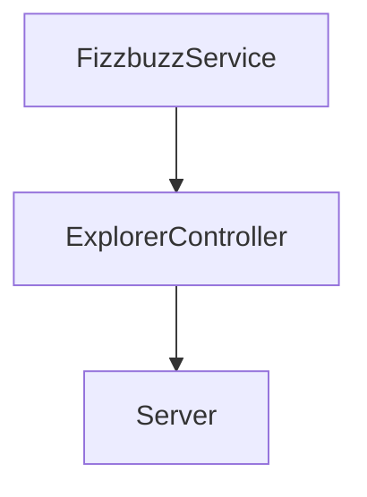

# Practice Launch X

### New feature

This is a repository where we are going to add a new functionality to our refactoring code.

The new functionality, given a score, will return Fizz, Buzz, FizzBuzz or the score.

The flow of the new functionality is as follows:



To achieve this we create the next static method in `FuzzbuzzService`

```
static applyValidationInNumber(number){
    if(isNaN(number))
        return "Error: The value is not a number";

    if(number % 3 == 0 && number % 5 == 0)
        return "FIZZBUZZ";
    else if(number % 3 == 0)
        return "FIZZ";
    else if(number % 5 == 0)
        return "BUZZ";
    else
        return number;
}
```

Then in our `ExplorerController` we add the call to the previous static method

```
class ExplorerController {
    static getValidationFizzBuzzInNumber(number){
        return FizzbuzzService.applyValidationInNumber(number);
    }
}
```

Lastly, we add to our server a new endpoint for this functionality.

```
app.get("/v1/fizzbuzz/:score",(request, response) => {
    const score = request.params.score;
    const trick = ExplorerController.getValidationFizzBuzzInNumber(score);
    response.json({score: request.params.score, trick: trick});
});
```

These are the expected values:
| Endpoint | Request | Response |
|---|---|---|
| `localhost:3000/v1/fizzbuzz/:score` | `localhost:3000/v1/fizzbuzz/one` | `{score: 1, trick: "Error: The value is not a number"}` |
| `localhost:3000/v1/fizzbuzz/:score` | `localhost:3000/v1/fizzbuzz/1` | `{score: 1, trick: 1}` |
| `localhost:3000/v1/fizzbuzz/:score` | `localhost:3000/v1/fizzbuzz/3` | `{score: 3, trick: "Fizzz"}` |
| `localhost:3000/v1/fizzbuzz/:score` | `localhost:3000/v1/fizzbuzz/5` | `{score: 5, trick: "Buzz"}` |
| `localhost:3000/v1/fizzbuzz/:score` | `localhost:3000/v1/fizzbuzz/15` | `{score: 15, trick: "Fizzbuzz"}` |